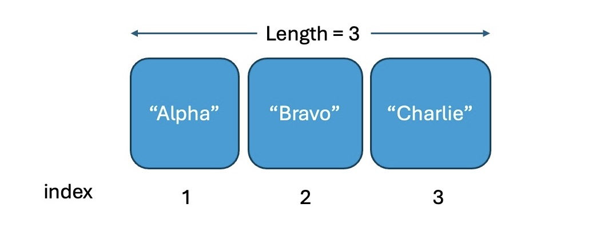
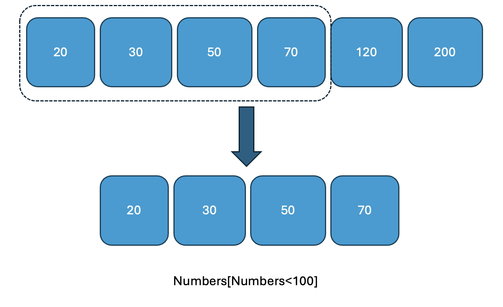

```{r setup, include=FALSE}
library(learnr)
library(tidyverse)
library(openintro)
library(emo)
library(shiny)

knitr::opts_chunk$set(echo = FALSE, message = FALSE, warning = FALSE)

tutorial_options(exercise.eval = FALSE)


my_reveal_time <- "2026-09-20 15:00:00"  # solution reveal time


# Setup for in some exercise chunks ... because each chunk in learnr (shiny app) works independently (not sharing env) 

A <- 10

hsb2_public <- hsb2 |> 
  filter(schtyp == "public")

avg_read <- mean(hsb2$read)

numbers<-seq(10,60,10)


# Hash generation helpers
# Should ideally be loaded from the imstutorials package when it exists
is_server_context <- function(.envir) {
  # We are in the server context if there are the follow:
  # * input - input reactive values
  # * output - shiny output
  # * session - shiny session
  #
  # Check context by examining the class of each of these.
  # If any is missing then it will be a NULL which will fail.
  
  inherits(.envir$input, "reactivevalues") &
    inherits(.envir$output, "shinyoutput") &
    inherits(.envir$session, "ShinySession")
}

check_server_context <- function(.envir) {
  if (!is_server_context(.envir)) {
    calling_func <- deparse(sys.calls()[[sys.nframe() - 1]])
    err <- paste0("Function `", calling_func, "`", " must be called from an Rmd chunk where `context = \"server\"`")
    stop(err, call. = FALSE)
  }
}
encoder_logic <- function(strip_output = FALSE) {
  p <- parent.frame()
  check_server_context(p)
  # Make this var available within the local context below
  assign("strip_output", strip_output, envir = p)
  # Evaluate in parent frame to get input, output, and session
  local(
    {
      encoded_txt <- shiny::eventReactive(
        input$hash_generate,
        {
          # shiny::getDefaultReactiveDomain()$userData$tutorial_state
          state <- learnr:::get_tutorial_state()
          shiny::validate(shiny::need(length(state) > 0, "No progress yet."))
          shiny::validate(shiny::need(nchar(input$name) > 0, "No name entered."))
          shiny::validate(shiny::need(nchar(input$studentID) > 0, "Please enter your student ID"))
          user_state <- purrr::map_dfr(state, identity, .id = "label")
          user_state <- dplyr::group_by(user_state, label, type, correct)
          user_state <- dplyr::summarize(
            user_state,
            answer = list(answer),
            timestamp = dplyr::first(timestamp),
            .groups = "drop"
          )
          user_state <- dplyr::relocate(user_state, correct, .before = timestamp)
          user_info <- tibble(
            label = c("student_name", "student_id"),
            type = "identifier",
            answer = as.list(c(input$name, input$studentID)),
            timestamp = format(Sys.time(), "%Y-%m-%d %H:%M:%S %Z", tz = "UTC")
          )
          learnrhash::encode_obj(bind_rows(user_info, user_state))
        }
      )
      output$hash_output <- shiny::renderText(encoded_txt())
    },
    envir = p
  )
}

hash_encoder_ui <- {
  shiny::div("If you have completed this tutorial and are happy with all of your", "solutions, please enter your identifying information, then click the button below to generate your hash", textInput("name", "What's your name?"), textInput("studentID", "What is your student ID?"), renderText({
    input$caption
  }), )
}


solution_code_card <- function(code, title = "Solution") {
  tags$div(
    style = paste(
      "margin: 1rem 0 1.25rem;",
      "border: 1px solid #d7e3f3;",
      "border-left: 5px solid #2f6f9f;",
      "border-radius: 8px;",
      "background: #f8fbff;",
      "box-shadow: 0 2px 8px rgba(31, 45, 61, 0.08);",
      "overflow: hidden;"
    ),
    tags$div(
      style = paste(
        "display: flex;",
        "align-items: center;",
        "justify-content: space-between;",
        "gap: 0.75rem;",
        "padding: 0.7rem 0.9rem;",
        "background: #eef6ff;",
        "border-bottom: 1px solid #d7e3f3;"
      ),
      tags$strong(
        title,
        style = "color: #1f4e79; font-size: 1rem;"
      ),
      tags$span(
        "released",
        style = paste(
          "padding: 0.15rem 0.5rem;",
          "border-radius: 999px;",
          "background: #ffffff;",
          "color: #3c6478;",
          "font-size: 0.78rem;",
          "font-weight: 600;"
        )
      )
    ),
    tags$pre(
      style = paste(
        "margin: 0;",
        "padding: 0.9rem 1rem;",
        "background: #ffffff;",
        "border: 0;",
        "border-radius: 0;",
        "white-space: pre-wrap;",
        "text-align: left;"
      ),
      tags$code(
        htmltools::HTML(htmltools::htmlEscape(code)),
        style = paste(
          "display: block;",
          "margin: 0;",
          "padding: 0;",
          "color: #243447;",
          "font-size: 0.95rem;",
          "line-height: 1.45;",
          "text-align: left;",
          "text-indent: 0;"
        )
      )
    )
  )
}


timed_solution <- function(output_id, code, title = "Solution",
                           reveal_time = my_reveal_time,
                           tz = "America/New_York",
                           check_every_ms = 1000) {
  p <- parent.frame()
  check_server_context(p)

  p$output[[output_id]] <- shiny::renderUI({
    shiny::invalidateLater(check_every_ms, p$session)

    release_at <- as.POSIXct(reveal_time, tz = tz)
    if (Sys.time() < release_at) {
      return(NULL)
    }

    solution_code_card(code, title)
  })
}
```


## Welcome

Hello, and welcome to **Language of Data and R Basics**!

In this tutorial we will take you through concepts and R code that are
essential for getting started with data analysis. This tutorial is one
of the two preparation tutorials for **Lab 2**, where you will classify
variables, inspect data, and begin transforming data in R.

Scientists seek to answer questions using rigorous methods and careful
observations. These observations form the backbone of a statistical
investigation and are called data. Statistics is the study of how best
to collect, analyze, and draw conclusions from data. It is helpful to
put statistics in the context of a general process of investigation:

- **Step 1**: Identify a question or problem.

- **Step 2**: Collect relevant data on the topic.

- **Step 3**: Analyze the data.

- **Step 4**: Form a conclusion.

We will focus on **steps 1 and 2** of this process in this tutorial.

Our learning goals for the tutorial are *to internalize the language of
data, load and view a dataset in R and distinguish between various
variable types, classify a study as observational or experimental, and
determine the scope of inference, distinguish between various sampling
strategies, and identify the principles of experimental design.*

This tutorial does not assume any previous R experience, but if you
would like an introduction to R first, we recommend the [RStudio
Primers](https://rstudio.cloud/learn/primers) or the [R
Bootcamp](https://r-bootcamp.netlify.com/).

## Packages

Packages are the fundamental units of reproducible R code. They include
reusable functions, the documentation that describes how to use them,
and sample data. In this lesson we will make use of two packages:

- **tidyverse**: Tidyverse is a collection of R packages for data
  science that adhere to a common philosophy of data and R programming
  syntax, and are designed to work together naturally. You can learn
  more about tidyverse [here](https://tidyverse.org/). But no need to go
  digging through the package documentation, we will walk you through
  what you need to know about these packages as they become relevant.
- **openintro**: The openintro package contains datasets used in
  openintro resources. You can find out more about the package
  [here](http://openintrostat.github.io/openintro).

Once we have installed the packages, we use the `library()` function to
load packages into R.

Let's load these two packages to be used in the remainder of this
lesson.

```{r load-packages, exercise=TRUE}
library(tidyverse)
library(openintro)
```


## R is a calculator: basic operations

Basic math operations in R can be used as the following.

`+`: add

`-` : substract

`*` : multiply

`/` : divide

`^` or `**`: exponentiation

For example,

$(\frac{12}{24})^2$ can be obtained by

```{r calculator-example, exercise=TRUE}
(12/24)^(2) # divide 12 by 24, then square the result

(12/24)**(2) # alternative exponentiation operator
```


### Assign values to a variable

Let's say if you want to save 10 to variable `A`. You can do the
following command.

```{r assign-values, exercise=TRUE}
A <- 10

A = 10 #   '=' doesn't mean equal sign. It is the same as `<-` operator
```


Note: The `#` symbol is used to write comments in R code.

And you can check what value the variable `A` has by calling it or using
`print()` function

```{r print-values-setup, include=FALSE}
A <- 10
```

```{r print-values, exercise=TRUE, exercise.setup="print-values-setup"}
A # calling the variable will display its value
print(A) # explicitly print the value of the variable
```


### Strings (character type)

You need to put either single quote or double quotes before and after
the string (text) type values.

```{r string-values, exercise=TRUE}
s1 <- "Hello, world!"   # double quotes
s2 <- 'R is great'      # single quotes also work
s1
s2
```


### Concatenate strings

You can concatenate the strings using `paste()` or `paste0()` functions.

```{r concatenate-values, exercise=TRUE}
greeting <- paste("Hello", "world", sep = ", ")
greeting
greeting2 <- paste0("Hello", "world")  # paste0 has no separator argument needed. But there is no values in between. 
greeting2
```


## Assign values to a vector

You can assign multiple values to a vector.

```{r assign-values-vector, exercise=TRUE}
GPA <- c(3.2, 3.7, 3.9, 2.3, 2.7)
FirstName <- c("Tom", "Sarah", "Nick", "Amy", "John")
GPA
FirstName
```


There are some useful functions for a vector

- `seq(from=a, to=b, by=c)` : this generates a sequence vector from
  value a to b by c increment.

- `rep(x, times = n)` : this replicate element `x` for n times.

- `length(x)` : this will give you the length of vector `x`

You can make a vector by using those functions.

For example,

```{r vector1example, exercise=TRUE}
my_vector = seq(1, 10, 2)
my_vector
```

```{r vector2example, exercise=TRUE}
another_vector = 1:10
another_vector
```

```{r vector3example, exercise=TRUE}

vector3 = rep("BU", 25)
vector3
```


## Variable Type Checkpoint

Before working with more data objects, pause to identify the type of
data R would use to store each value.

- **numeric** values are numbers that can be used in calculations.
- **character** values are text values, usually written inside quotation
  marks.
- **logical** values are `TRUE` or `FALSE`.
- **factor** values store group labels with a fixed set of possible
  categories.

For each variable below, write whether R should store it as numeric,
character, logical, or factor.


```{r variable-type-multiple-choice, echo=FALSE}
quiz(
  question(
    "Which value should usually be stored as character data in R?",
    answer("98.5"),
    answer("\"BU Terrier\"", correct = TRUE),
    answer("TRUE"),
    answer("FALSE"),
    allow_retry = TRUE
  )
)
```


## Reading and Fixing an Error

Errors are part of using R. The useful habit is to read the message,
find the location of the problem, and make a small correction.

Run the code below. Then fix it so R creates and prints the vector.

```{r fix-vector-error, exercise=TRUE}
broken_numbers <- c(2, 4, 6, 8
broken_numbers
```

```{r fix-vector-error-hint-1}
# Check whether every opening parenthesis has a matching closing parenthesis.
```


## Your turn!

### Assign numeric value 655 to the variable named `number` and print it

```{r ex1, exercise=TRUE}
```

```{r ex1-hint-1}
variable_name <- value
```

```{r ex1-hint-2}
variable_name = value # This also works
```

```{r, context="server", echo=FALSE}
timed_solution(
  "ex1_solution_code",
  "number <- 655\nprint(number)"
)
```

```{r ex1-solution-ui, echo=FALSE}
uiOutput("ex1_solution_code")
```


### Assign the following value to a vector `some_numbers` and print it.

1, 3, 5, 7, 9, 11

```{r ex2, exercise=TRUE}
```

```{r ex2-hint-1}
# Try seq(); it is the number from 1 to 11 increasing by 2.

```

```{r, context="server", echo=FALSE}
timed_solution(
  "ex2_solution_code",
  "some_numbers <- seq(1, 11, 2)\nprint(some_numbers)"
)
```

```{r ex2-solution-ui, echo=FALSE}
uiOutput("ex2_solution_code")
```


## Accessing vector elements

Each element in a vector is associated with index number. The index in R
starts from 1 as the first item.

For example,

```{r access-vector1, exercise=TRUE}
#
SomeNames <- c("Alpha", "Bravo", "Charlie")

SomeNames
```


{width="500" height="250"}

For example,

You can access the third element of `SomeNames` by `SomeNames[3]` .

You can also access, for example, the second and the third elements by
`SomeNames[2:3]` .

```{r access-vector2, exercise=TRUE}
SomeNames <- c("Alpha", "Bravo", "Charlie")
print(SomeNames[3]) # third element
print(SomeNames[2:3]) # second and third elements
```


## Subset vectors

Vectors can be subsetted using condition

``` {.R style="gray"}
                         x[condition]
```

the conditional statements (condition) you can use could be

``` {.R style="yellow"}
x == 20    # x equals to 20
x < 100
x <= 100
x > 100
x >= 100
x != 100   # x not equal to 100
```

For example, you can return all the numbers less than 100

```{r subset1, exercise=TRUE}
Numbers <- c(20, 30, 50, 70, 120, 200)
Numbers[Numbers < 100] 
```


{width="500"
height="350"}

## Your turn!

### Assign the following value to a vector `numbers` and print it.

10, 20, 30, 40, 50, 60

```{r subset-ex1, exercise=TRUE}

```

```{r subset-ex1-hint-1}
# Try seq(); it is the number from 10 to 11 increasing by 2.

```

```{r, context="server", echo=FALSE}
timed_solution(
  "subset-ex1_solution_code",
  "numbers<-seq(10,60,10) \nnumbers"
)
```

```{r subset-ex1-solution-ui, echo=FALSE}
uiOutput("subset-ex1_solution_code")
```


From `numbers` object, print the numbers that are less than 40.

```{r subset-ex2, exercise=TRUE}
```

```{r subset-ex2-hint-1}
# the condition is 
numbers < 40
```

```{r subset-ex2-hint-2}
# You can put the condition within the numbers with square brackets

```

```{r, context="server", echo=FALSE}
timed_solution(
  "subset_ex2_solution_code",
  "numbers[numbers<40]"
)
```

```{r subset-ex2-solution-ui, echo=FALSE}
uiOutput("subset_ex2_solution_code")
```


## Submit

```{r, echo=FALSE, context="server"}
encoder_logic()
```

```{r encode, echo=FALSE}
learnrhash::encoder_ui(ui_before = hash_encoder_ui)
```