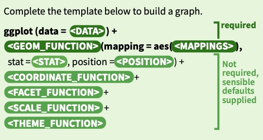

```{r setup, include=FALSE}
library(learnr)
library(tidyverse)
library(openintro)
library(emo)
library(shiny)

knitr::opts_chunk$set(echo = FALSE, message = FALSE, warning = FALSE)

tutorial_options(exercise.eval = FALSE)


my_reveal_time <- "2026-06-20 15:00:00"  # solution reveal time


# Setup for some exercise chunks because each learnr chunk works independently.
df <- read.csv("airquality.csv")
df_air <- read.csv("airquality.csv")
df_titanic <- read.csv("Titanic.csv")


# Hash generation helpers
# Should ideally be loaded from the imstutorials package when it exists
is_server_context <- function(.envir) {
  # We are in the server context if there are the follow:
  # * input - input reactive values
  # * output - shiny output
  # * session - shiny session
  #
  # Check context by examining the class of each of these.
  # If any is missing then it will be a NULL which will fail.
  
  inherits(.envir$input, "reactivevalues") &
    inherits(.envir$output, "shinyoutput") &
    inherits(.envir$session, "ShinySession")
}

check_server_context <- function(.envir) {
  if (!is_server_context(.envir)) {
    calling_func <- deparse(sys.calls()[[sys.nframe() - 1]])
    err <- paste0("Function `", calling_func, "`", " must be called from an Rmd chunk where `context = \"server\"`")
    stop(err, call. = FALSE)
  }
}
encoder_logic <- function(strip_output = FALSE) {
  p <- parent.frame()
  check_server_context(p)
  # Make this var available within the local context below
  assign("strip_output", strip_output, envir = p)
  # Evaluate in parent frame to get input, output, and session
  local(
    {
      encoded_txt <- shiny::eventReactive(
        input$hash_generate,
        {
          # shiny::getDefaultReactiveDomain()$userData$tutorial_state
          state <- learnr:::get_tutorial_state()
          shiny::validate(shiny::need(length(state) > 0, "No progress yet."))
          shiny::validate(shiny::need(nchar(input$name) > 0, "No name entered."))
          shiny::validate(shiny::need(nchar(input$studentID) > 0, "Please enter your student ID"))
          user_state <- purrr::map_dfr(state, identity, .id = "label")
          user_state <- dplyr::group_by(user_state, label, type, correct)
          user_state <- dplyr::summarize(
            user_state,
            answer = list(answer),
            timestamp = dplyr::first(timestamp),
            .groups = "drop"
          )
          user_state <- dplyr::relocate(user_state, correct, .before = timestamp)
          user_info <- tibble(
            label = c("student_name", "student_id"),
            type = "identifier",
            answer = as.list(c(input$name, input$studentID)),
            timestamp = format(Sys.time(), "%Y-%m-%d %H:%M:%S %Z", tz = "UTC")
          )
          learnrhash::encode_obj(bind_rows(user_info, user_state))
        }
      )
      output$hash_output <- shiny::renderText(encoded_txt())
    },
    envir = p
  )
}

hash_encoder_ui <- {
  shiny::div("If you have completed this tutorial and are happy with all of your", "solutions, please enter your identifying information, then click the button below to generate your hash", textInput("name", "What's your name?"), textInput("studentID", "What is your student ID?"), renderText({
    input$caption
  }), )
}


solution_code_card <- function(code, title = "Solution") {
  tags$div(
    style = paste(
      "margin: 1rem 0 1.25rem;",
      "border: 1px solid #d7e3f3;",
      "border-left: 5px solid #2f6f9f;",
      "border-radius: 8px;",
      "background: #f8fbff;",
      "box-shadow: 0 2px 8px rgba(31, 45, 61, 0.08);",
      "overflow: hidden;"
    ),
    tags$div(
      style = paste(
        "display: flex;",
        "align-items: center;",
        "justify-content: space-between;",
        "gap: 0.75rem;",
        "padding: 0.7rem 0.9rem;",
        "background: #eef6ff;",
        "border-bottom: 1px solid #d7e3f3;"
      ),
      tags$strong(
        title,
        style = "color: #1f4e79; font-size: 1rem;"
      ),
      tags$span(
        "released",
        style = paste(
          "padding: 0.15rem 0.5rem;",
          "border-radius: 999px;",
          "background: #ffffff;",
          "color: #3c6478;",
          "font-size: 0.78rem;",
          "font-weight: 600;"
        )
      )
    ),
    tags$pre(
      style = paste(
        "margin: 0;",
        "padding: 0.9rem 1rem;",
        "background: #ffffff;",
        "border: 0;",
        "border-radius: 0;",
        "white-space: pre-wrap;",
        "text-align: left;"
      ),
      tags$code(
        htmltools::HTML(htmltools::htmlEscape(code)),
        style = paste(
          "display: block;",
          "margin: 0;",
          "padding: 0;",
          "color: #243447;",
          "font-size: 0.95rem;",
          "line-height: 1.45;",
          "text-align: left;",
          "text-indent: 0;"
        )
      )
    )
  )
}


timed_solution <- function(output_id, code, title = "Solution",
                           reveal_time = my_reveal_time,
                           tz = "America/New_York",
                           check_every_ms = 1000) {
  p <- parent.frame()
  check_server_context(p)

  p$output[[output_id]] <- shiny::renderUI({
    shiny::invalidateLater(check_every_ms, p$session)

    release_at <- as.POSIXct(reveal_time, tz = tz)
    if (Sys.time() < release_at) {
      return(NULL)
    }

    solution_code_card(code, title)
  })
}
```


## Welcome

Hello, and welcome to **Data Visualization**!

In this tutorial we will use R to create basic plots with `ggplot2`.
We will work with the New York air quality data and the Titanic data to
make histograms, boxplots, scatterplots, barplots, and a pie chart.
This tutorial is preparation for **Lab 3**, where you will use plots and
tables as evidence for written interpretations.

Our learning goals are to:

- map variables to plot features with `aes()`;
- use common geoms such as `geom_histogram()`, `geom_boxplot()`,
  `geom_point()`, and `geom_col()`;
- add labels to plots with `labs()`;
- summarize data before plotting when a plot needs counts or medians.

## Packages

This lesson uses four packages:

- **dplyr** for data transformation before plotting
- **ggplot2** for plotting
- **readr** for reading data files
- **tidyr** for removing missing values

```{r load-packages, exercise=TRUE}
library(dplyr)
library(ggplot2)
library(readr)
library(tidyr)
```

## Graphics with `ggplot2`

Plotting with `ggplot2` begins with:

```{r ggplot-template, exercise=TRUE}
ggplot(data = df, aes(x = Ozone, y = Temp))
```

Inside `aes()`, we specify which variables are mapped to the x-axis,
y-axis, color, fill, or other visual features.

Then we add a geometric object, or **geom**, such as:

- `geom_point()` for scatterplots
- `geom_line()` for trend lines or time series
- `geom_histogram()` for histograms
- `geom_boxplot()` for boxplots
- `geom_col()` for barplots using pre-counted data

[](https://github.com/rstudio/cheatsheets/blob/main/data-visualization.pdf)

## Choose the Plot Checkpoint

Before writing code, match the plot to the question and variable types.
Write a good plot choice for each situation below.

```{r choose-plot-checkpoint, exercise=TRUE}
# One numerical variable, such as Ozone:
# Two numerical variables, such as Ozone and Temp:
# One categorical variable, such as Survived:
# Two categorical variables, such as Survived and Class:
```

## Plots for New York Air Quality Data

We will examine the distribution of `Ozone` and the relationship between
`Ozone` and `Temp`.

```{r import-airquality-plots, exercise=TRUE}
df_air <- read.csv("airquality.csv")
```

## Summary of `Ozone`

```{r ozone-summary, exercise=TRUE}
summary(df_air$Ozone)
```

## Stacked Dot Plot of `Ozone`

```{r ozone-dotplot, exercise=TRUE}
ggplot(data = df_air, aes(Ozone)) + 
  geom_dotplot(binwidth = 5)
```

## Boxplot of `Ozone`

```{r ozone-boxplot, exercise=TRUE}
ggplot(data = df_air, aes(Ozone)) +
  geom_boxplot()
```

This plot shows two suspected outliers.

## Histogram of `Ozone`

```{r ozone-histogram, exercise=TRUE}
ggplot(data = df_air) + 
  geom_histogram(mapping = aes(Ozone), binwidth = 5)
```

## Histograms with Different Bin Options

The number of bins changes how the distribution appears.

```{r ozone-histogram-bins, exercise=TRUE}
ggplot(data = df_air) +
  geom_histogram(aes(Ozone), bins = 5)

ggplot(data = df_air, aes(Ozone)) + 
  geom_histogram(bins = 30)
```

## Labels in Plots

Use `labs()` to add axis labels and a title.

```{r ozone-histogram-labels, exercise=TRUE}
ggplot(data = df_air, aes(Ozone)) + 
  geom_histogram(bins = 30, color = "yellow") +
  labs(x = "Ozone Level",
       y = "Count",
       title = "Histogram with 30 bins")
```

## Scatterplot of `Ozone` and `Temp`

We can use a scatterplot to examine whether ozone and temperature are
related.

```{r ozone-temp-scatterplot, exercise=TRUE}
ggplot(df_air) +
  geom_point(aes(x = Ozone, y = Temp)) + 
  labs(title = "Scatterplot of Ozone vs Temperature")
```

## Titanic Data

Now we will work with the Titanic data in `Titanic.csv`.

```{r import-titanic, exercise=TRUE}
df_titanic <- read.csv("Titanic.csv")
glimpse(df_titanic)
```

## Barplot for `Survived`

```{r survived-barplot, exercise=TRUE}
new_df_titanic <- df_titanic %>%
  count(Survived)

ggplot(new_df_titanic, aes(x = Survived, y = n)) +
  geom_col()
```

## Barplot of `Survived` and `Class`

First, create the summary table.

```{r survived-class-summary, exercise=TRUE}
df_titanic %>% 
  group_by(Survived, Class) %>%
  summarise(count = n())
```

Then add `ggplot()` and `geom_col()`.

```{r survived-class-barplot, exercise=TRUE}
df_titanic %>% 
  group_by(Survived, Class) %>%
  summarise(count = n()) %>%
  ggplot(aes(x = factor(Survived), y = count, fill = factor(Class))) +
  geom_col(position = "fill") +
  labs(x = "Survived")
```

## Pie Chart of `Class`

First, create a count table.

```{r class-table, exercise=TRUE}
table_data <- df_titanic %>% 
  count(Class) %>%
  mutate(Class = factor(Class))

table_data
```

Then use `coord_polar()` to turn a bar chart into a pie chart.

```{r class-pie-chart, exercise=TRUE}
ggplot(data = table_data, aes(x = "", y = n, fill = Class)) +
  geom_col() +
  geom_text(aes(label = n), position = position_stack(vjust = 0.5)) + 
  coord_polar(theta = "y") +
  theme_void()
```

Pie charts can be useful for showing rough composition, but bar plots
are usually easier when the goal is to compare category sizes.

## Your Turn 3

### Filter and Plot Ozone Levels

In the air quality data, filter the data to include only the months June
through September and print it.

```{r ex-filter-not-may, exercise=TRUE}
df_air <- read.csv("airquality.csv")
```

### Create a Barplot of Monthly Median Ozone

Remove missing values first. Then calculate the median ozone level for
each month and plot the results.

```{r ex-monthly-median-barplot, exercise=TRUE}
```

### Create a Histogram of `Ozone`

Use the filtered data from June through September.

```{r ex-filtered-ozone-histogram, exercise=TRUE}
```

```{r ex-filter-plot-hint-1}
# June through September means Month is not 5 in this data set.
df_air_not_May <- df_air %>%
  filter(Month != 5)
```

```{r, context="server", echo=FALSE}
timed_solution(
  "ex_filter_plot_solution_code",
  "df_air <- read.csv(\"airquality.csv\")\n\ndf_air_not_May <- df_air %>%\n  filter(Month != 5)\n\ndf_air_not_May\n\ndf_air_not_May_clean <- df_air_not_May %>%\n  drop_na()\n\ndf_air_not_May_clean %>%\n  group_by(Month) %>%\n  summarise(Median = median(Ozone)) %>%\n  ggplot(aes(x = Month, y = Median)) +\n  geom_col()\n\ndf_air_not_May_clean %>%\n  ggplot(aes(x = Ozone)) +\n  geom_histogram()"
)
```

```{r ex-filter-plot-solution-ui, echo=FALSE}
uiOutput("ex_filter_plot_solution_code")
```

## Submit

```{r, echo=FALSE, context="server"}
encoder_logic()
```

```{r encode, echo=FALSE}
learnrhash::encoder_ui(ui_before = hash_encoder_ui)
```
